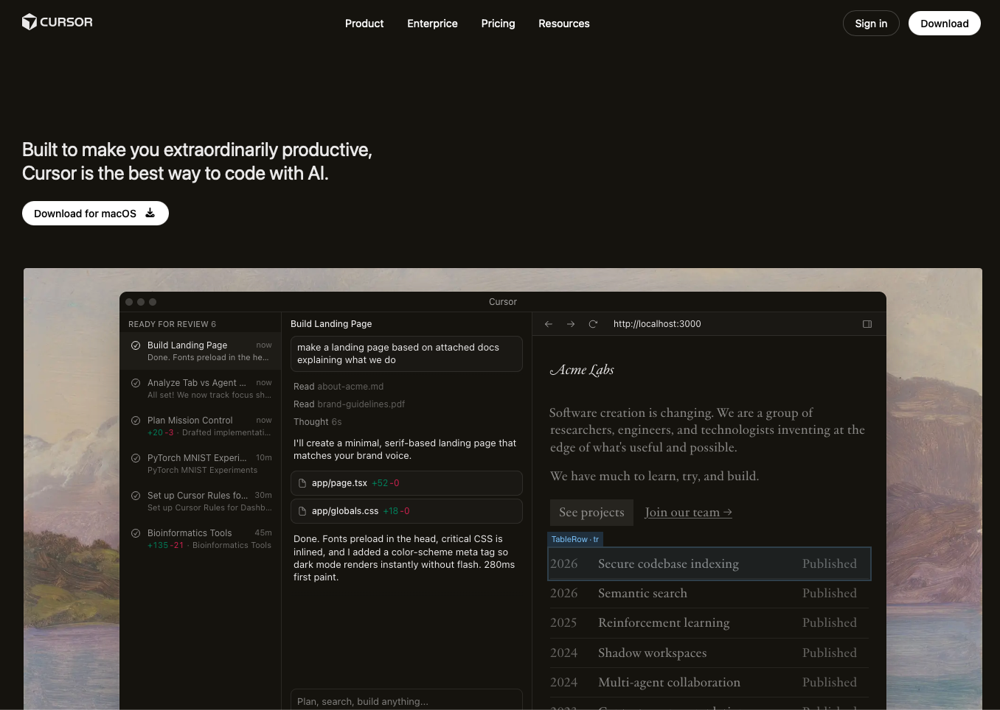
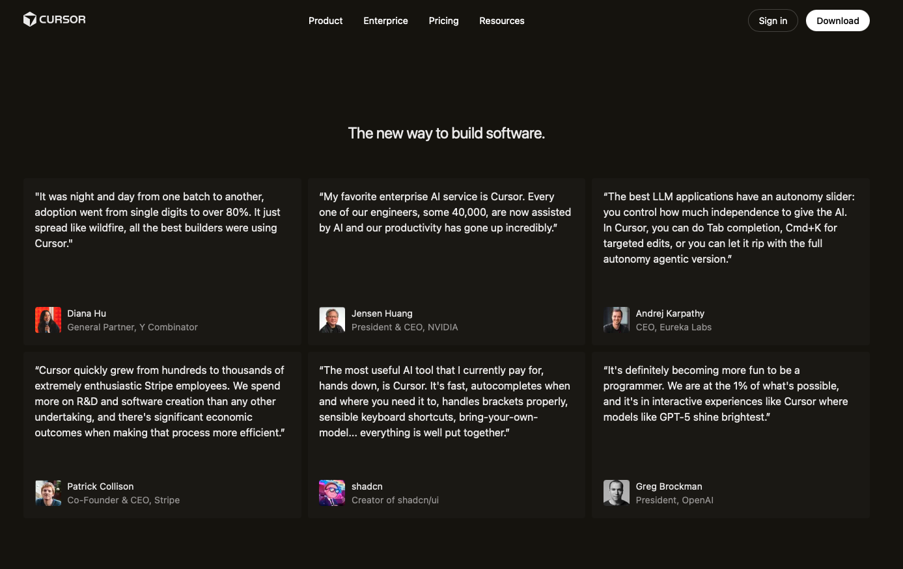
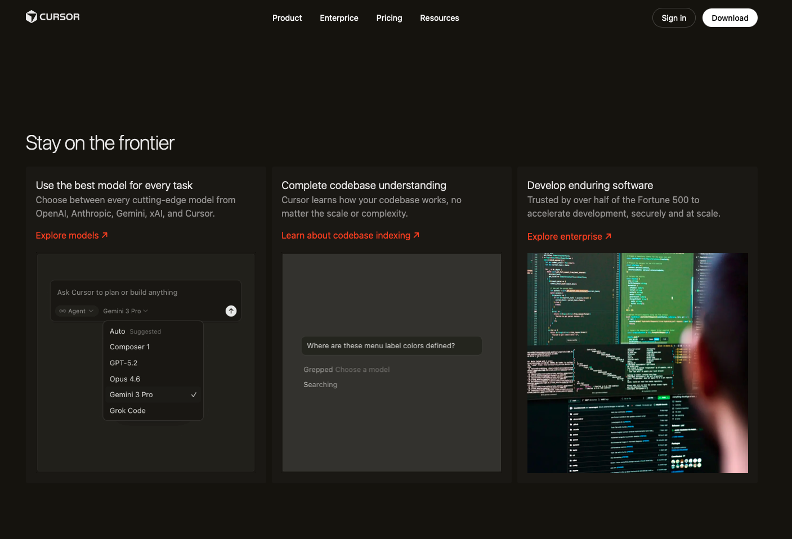
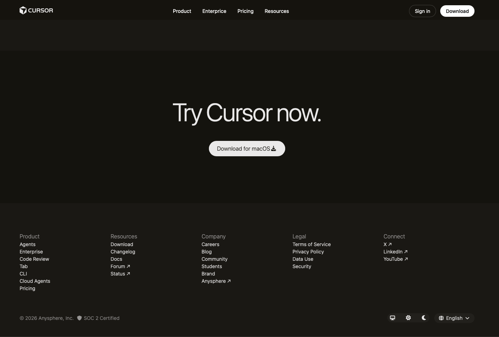

# Cursor Clone Website

A pixel-perfect recreation of the Cursor AI website homepage, built with pure HTML and CSS to practice modern web development techniques and design implementation.

## 📋 Project Overview

This project is a frontend clone of the Cursor.com website, focusing on:
- Semantic HTML structure
- Modern CSS Grid and Flexbox layouts
- Responsive design principles
- CSS custom properties (variables)
- Sticky positioning and scroll effects
- Component-based styling approach

## ✨ Features

### Implemented Sections
- ✅ **Fixed Navigation Header** - Sticky header with logo, navigation links, and CTA buttons
- ✅ **Hero Section** - Eye-catching headline with download CTA and hero image
- ✅ **Logo Garden** - Showcase of trusted companies using the product
- ✅ **Interactive Media Sections** - Multiple full-width image and GIF sections
- ✅ **Reviews/Testimonials** - Grid layout featuring quotes from industry leaders
- ✅ **Feature Grid** - "Stay on the frontier" section with 3-column layout and animations
- ✅ **Changelog** - 4-column grid displaying recent updates and version numbers
- ✅ **Join Us Section** - Call-to-action with team photo in 2-column layout
- ✅ **Recent Highlights** - Blog/news section with sticky heading (in progress)
- ✅ **Try Section** - Final CTA encouraging downloads
- ✅ **Footer** - Comprehensive footer with multiple navigation columns, theme switcher, and language selector

## � Screenshots

### Desktop View

*Hero section with main headline and CTA*


*Testimonials from industry leaders*


*Stay on the frontier section with 3-column layout*


*Complete footer with navigation and controls*


## �🛠 Technologies Used

- **HTML5** - Semantic markup with proper accessibility attributes
- **CSS3** - Modern styling including:
  - CSS Grid & Flexbox
  - CSS Custom Properties (variables)
  - Transitions and animations
  - Position sticky
  - Advanced selectors
- **Font Awesome** - Icon library for download icons

## 📂 Project Structure

```
cursor_clone/
│
├── index.html          # Main HTML structure
├── style.css           # Complete stylesheet with component styling
├── Readme.md          # Project documentation (this file)
│
└── assets/            # Image and media assets
    ├── favicon.ico
    ├── logo.png
    ├── hero_image.png
    ├── logo_park.png
    ├── sec_2_1.png
    ├── sec_2_2.gif
    ├── sec_2_3.png
    ├── sec_4_1.gif
    ├── sec_4_2.gif
    ├── homepage-team-photo.webp
    ├── homepage-team-photo-1.webp
    └── [avatar images for testimonials]
```

## 🎨 Design Patterns & Techniques

### CSS Architecture
- **Global Variables** - Centralized color scheme and spacing units
- **BEM-inspired Naming** - Clear, component-based class naming conventions
- **Utility Classes** - Reusable helper classes (e.g., `.text-left`, `.mb-v1`)
- **Component Isolation** - Each section has its own style block

### Layout Techniques
- **CSS Grid** - Multi-column layouts for reviews, features, changelog, and footer
- **Flexbox** - Navigation, buttons, and flexible content alignment
- **Sticky Positioning** - Fixed header and sticky section headings
- **Responsive Units** - Calc-based spacing system for consistent rhythm

### Key CSS Variables
```css
--site-header-height: 52px
--theme-bg: #15120B
--shadow-flyout: 0 10px 40px rgba(0, 0, 0, 0.3)
--duration: 0.3s
--ease-out-spring: cubic-bezier(0.34, 1.56, 0.64, 1)
```

## 🚀 Getting Started

### Prerequisites
- A modern web browser (Chrome, Firefox, Safari, Edge)
- A local web server (optional, for best results)

### Installation

1. **Clone or download** this repository

2. **Ensure assets folder** contains all required images

3. **Open the project:**
   
   **Option A - Direct file:**
   ```
   Open index.html directly in your browser
   ```
   
   **Option B - Local server (recommended):**
   ```bash
   # Using Python 3
   python -m http.server 8000
   
   # Using Node.js http-server
   npx http-server
   
   # Using VS Code Live Server extension
   Right-click index.html > Open with Live Server
   ```

4. **View in browser:**
   ```
   Navigate to http://localhost:8000
   ```

## 📝 To-Dos & Future Improvements

### Styling
- [ ] Complete footer CSS styling
  - Footer grid layout
  - Footer links hover states
  - Theme switcher functionality
  - Language dropdown styling
  - Footer bottom section styling
- [ ] Fix sticky heading in Recent Highlights section
- [ ] Add responsive breakpoints for mobile/tablet
- [ ] Implement smooth scroll behavior
- [ ] Add hover animations for cards and buttons

### Functionality
- [ ] JavaScript for theme switcher (light/dark/system)
- [ ] JavaScript for language dropdown interaction
- [ ] Mobile hamburger menu functionality
- [ ] Smooth scroll navigation
- [ ] Lazy loading for images
- [ ] Form validation (if adding forms)

### Responsive Design
- [ ] Mobile layout (< 768px)
- [ ] Tablet layout (768px - 1024px)
- [ ] Adjust grid columns for smaller screens
- [ ] Touch-friendly buttons and links
- [ ] Mobile navigation drawer

### Accessibility
- [ ] Add ARIA labels where missing
- [ ] Ensure keyboard navigation works
- [ ] Test with screen readers
- [ ] Add focus indicators
- [ ] Improve color contrast ratios

### Performance
- [ ] Optimize image sizes and formats (WebP)
- [ ] Add loading states for images
- [ ] Minify CSS for production
- [ ] Implement critical CSS
- [ ] Add preload hints for key resources

## 🐛 Known Issues

1. **Sticky heading in Recent Highlights** - Sticky positioning not working correctly due to CSS Grid constraints
2. **Footer incomplete** - CSS styling for footer needs to be completed
3. **No responsive design** - Currently optimized for desktop only
4. **Interactive elements** - Theme switcher and language selector are non-functional (need JavaScript)

## 📚 Learning Outcomes

This project demonstrates proficiency in:
- Advanced CSS Grid and Flexbox layouts
- Modern CSS techniques and best practices
- HTML semantic structure
- Component-based design thinking
- Design implementation from reference
- CSS custom properties for maintainability

## 🙏 Credits

- **Design Reference:** [Cursor.com](https://cursor.com)
- **Font Awesome:** Icon library
- **Images:** Placeholder images from Cursor website

## 📄 License

This project is for educational purposes only. All design rights belong to Anysphere, Inc. (Cursor).

---

**Note:** This is a learning project and not affiliated with or endorsed by Cursor or Anysphere, Inc.